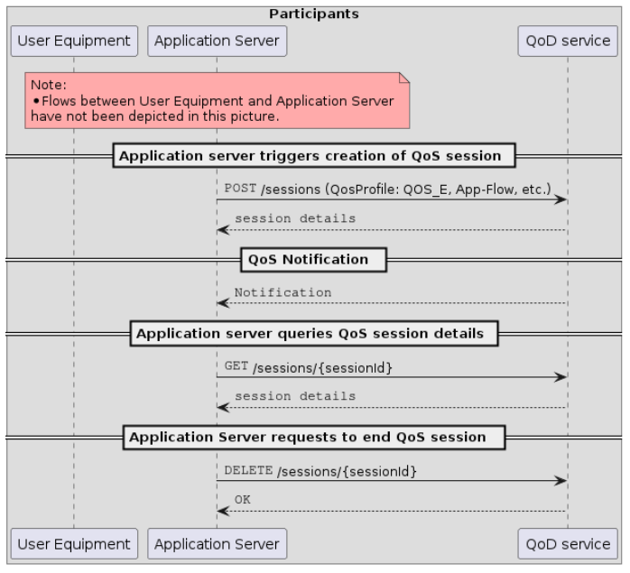

# CAMARA Quality on Demand (QoD) API

## Overview

The Quality-On-Demand (QoD) API provides a programmable interface for developers to request stable throughput from the network without requiring in-depth knowledge of the underlying network complexity (e.g., 4G/5G systems).

This service implements the CAMARA QoD API specification, acting as a gateway that translates CAMARA-compliant requests into 3GPP AsSessionWithQoS format for network integration.


## How It Works

The QoD API allows developers to request prioritized network quality for specific application data flows between:
- **Application clients** (within user devices)
- **Application servers** (backend services)

Developers select from pre-defined **QoS profiles** that map to their throughput requirements, ensuring stable performance even during network congestion.

## Key Concepts

### QoS Profiles
Pre-defined quality levels that specify latency, throughput, or priority requirements. Available profiles can be retrieved via the qos-profiles API or agreed upon during onboarding.

The following QoS profiles are currently supported:

- **QOS_E**: 1 Mbps download/upload bandwidth for video applications
- **QOS_S**: 4 Mbps download/upload bandwidth for video applications  
- **QOS_M**: 8 Mbps download/upload bandwidth for video applications
- **QOS_L**: 20 Mbps download/upload bandwidth for audio applications


### Device Identification
At least one identifier for the user device:
- **IPv4 address** (with optional public/private addresses and port)
- **IPv6 address**
- **Phone number**
- **Network Access Identifier** (future use)

### Application Server
IPv4 and/or IPv6 address of the backend server. Supports CIDR notation (e.g., `192.168.1.0/24`) and wildcard (`0.0.0.0/0` → `any`).


### Duration
Time (in seconds) for which the QoS session should be active. Sessions can be:
- Automatically terminated after duration expires
- Manually deleted by the user
- Extended during the session lifetime

### Notifications
Optional callback URL (`sink`) where CloudEvents notifications about session status changes are sent:
- `AVAILABLE`: QoS successfully allocated
- `UNAVAILABLE`: QoS not available or terminated
- Status info: `DURATION_EXPIRED`, `NETWORK_TERMINATED`, `DELETE_REQUESTED`


## Architecture



## API Functionality

The QoD API enables:

1. **Prioritized App-Flows**: Ensure stable throughput for specific data flows
2. **Flow Definition**: Specify flows using device identifiers, server addresses, and ports
3. **Duration Control**: Define how long the prioritized flow should be active
4. **Profile Selection**: Choose appropriate QoS profiles (e.g., `QOS_E`)
5. **Event Notifications**: Receive real-time updates on session status changes

## Quick Start

### Installation

```bash
git clone https://github.com/FRONT-research-group/camara-QoD.git
cd camara-QoD/
```

### Setup

Create and activate virtual environment:

```bash
python3 -m venv venv
source venv/bin/activate
pip install -r requirements.txt
```

### Configuration

Edit environment variables in `src/app/utils/config.py`:

**ASSESSIONWITHQOS_URL**
- Set the URL of the running NEF service
- Example: `http://{nef-ip}:8001/3gpp-as-session-with-qos/v1`

**LOG_LEVEL**
- `INFO`: Standard logs
- `DEBUG`: Full debug logs

### Running the Service

**Option 1: Run Directly**

```bash
python3 src/main.py
```

Access the API documentation at: **http://localhost:8002/docs**

**Option 2: Run with Docker**

```bash
docker run -d \
  -e ASSESSIONWITHQOS_URL="http://nef-qos:8001/3gpp-as-session-with-qos/v1" \
  -e LOG_LEVEL="INFO" \
  -p 8002:8002 \
  ghcr.io/front-research-group/camara-qod
```

**Note:** Replace `nef-qos:8001` with your actual NEF service host and port.


## Notes

- **Tested with**: Amari RAN and Open5GS core network
- **Related Project**: [NEF-QoS](https://github.com/FRONT-research-group/NEF-QoS) - AsSessionWithQoS/NEF implementation
- **CAMARA QoD Official Swagger**: [API Documentation](https://camaraproject.github.io/swagger-ui/?url=https://raw.githubusercontent.com/camaraproject/QualityOnDemand/r3.2/code/API_definitions/quality-on-demand.yaml#/QoS%20Sessions/deleteSession)

---

## Support

For questions or issues, contact: **asakellaropoulos@iit.demokritos.gr**


